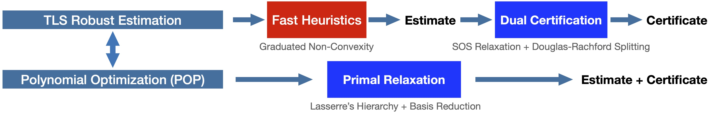

# One Ring to Rule Them All: Certifiably Robust Geometric Perception with Outliers

This repository is the official Matlab implementation of [One Ring to Rule Them All: Certifiably Robust Geometric Perception with Outliers](https://arxiv.org/abs/2006.06769), which has been accepted to be published in the 34th _Conference on Neural Information Processing Systems (NeurIPS)_, 2020.

If you find this implementation useful for your research, please cite:
```bibtex
@InProceedings{Yang20NeurIPS-CertifiablePerception,
    title={One Ring to Rule Them All: Certifiably Robust Geometric Perception with Outliers},
    author={Yang, Heng and Carlone, Luca},
    booktitle={Conference on Neural Information Processing Systems (NeurIPS)}
    year={2020},
    url = {https://github.com/MIT-SPARK/CertifiablyRobustPerception},
    pdf = {https://arxiv.org/abs/2006.06769}
}
```

## About

We propose the _first_ general framework for designing certifiable algorithms for a broad class of robust geometric perception problems. In particular, we study robust geometric perception under the _truncated least squares (TLS)_ estimator, which is known to be robust against a large amount of outliers, but leads to hard, non-smooth and non-convex optimizations. 

We first show that, a class of TLS estimation problems can be reformulated as polynomial optimizations (POP), which are equally hard, but exihibit special structural sparsity. Then, we provide two perspectives for designing certifiably robust algorithms:

- From the primal perspective, we apply Lasserre’s hierarchy of moment relaxations, together with basis reduction, to construct tight semidefinite relaxations to nonconvex POPs. Solving the semidefinite programs (SDP) simultaneously returns an accurate geometric estimate (e.g., 3D rotations and translations) and a certificate for global optimality. 

- From the dual perspective, we first leverage exisiting fast heuristics (e.g., GNC and RANSAC) to obtain a candidate estimate (without guarantees) to the TLS estimation problems, but then we use Sums-of-Squares (SOS) relaxation to convert the certification of the given candidate estimate to a convex feasibility SDP, and apply Douglas-Rachford Splitting to solve the feasibility SDP and compute a suboptimality for the candidate estimate (the estimate is globally optimal when the suboptimality is zero). 

Our primal relaxation is **tight**, and our dual certification is correct and **scalable** (beyond the reach of current SDP solvers).

Currently, this repo implements the following solvers:

- Primal solvers (both dense and sparse convex relaxations)
- Dual solvers (Douglas-Rachford Splitting)
- Fast heuristics using [graduated non-convexity](https://arxiv.org/abs/1909.08605)

for four geometric perception problems (see the [paper](https://arxiv.org/abs/2006.06769) for details of their formulations):

- Single rotation averaging
- Shape alignment (image-based pose estimation)
- Point cloud registration
- Mesh registration

## Requirements
All the algorithms are implemented in Matlab.

Download the following packages:
- [YALMIP](https://yalmip.github.io) (for deriving dense and sparse moment relaxations)
- [SOSTOOLS](https://www.dropbox.com/s/qci9xf404u7nakl/SOSTOOLS.zip?dl=0) (for manipulating multivariate polynomials)
- [MOSEK](https://www.mosek.com/downloads/) (for solving the semidefinite programs)

and put them at the same level of this repo (eg., if this repo's path is `~/Code/CertifiablyRobustPerception` in your system, then YALMIP's path should be `~/Code/YALMIP` in your systm.)

## Examples

### Solve geometric perception using primal relaxation
Run examples in the `example_relaxation` folder. 

### Solve geometric perception using fast heuristics plus dual certification
Run examples in the `example_certification` folder. 

## Resources on Certifiably Robust Perception
- TEASER: Fast and Certifiable Point Cloud Registration
    - Paper: https://arxiv.org/pdf/2001.07715.pdf
    - Code: https://github.com/MIT-SPARK/TEASER-plusplus
- RSS 2020 Tutorial: https://mit-spark.github.io/CertifiablePerception-RSS2020/


